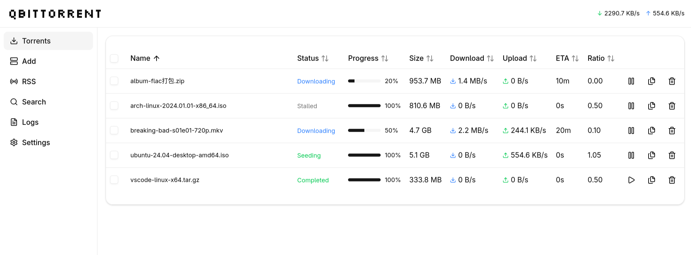

# qbitwebber

A minimalist, mobile-friendly frontend for qbittorrent web UI.

I built the initial version of this on a weekend because I felt the other options were a bit cluttered.

Built with React, Vite, and TypeScript.




## Features

- Manage Torrents
- RSS Feed
- Search
- Settings (Simplified Compared to Offical Web UI)
- Mobile-friendly responsive design

## Installation

Download the zip of this repository (or clone it) and then configure qbittorrent custom web UI path to the release directory.

## Development

During development the Vite dev server proxies API requests under `/api` to the qBittorrent backend.

By default the proxy target is set in `vite.config.ts` at `server.proxy['/api'].target`.

Change that value to the full URL (including protocol and port) where your qBittorrent backend is running. Examples:

- Default local qBittorrent: `http://localhost:8080`
- Remote machine on LAN: `http://192.168.1.100:8080`


To run in dev mode:

```bash
npm install
npm run dev
```

## Demo Mode

Run without a backend for demonstration purposes:

```bash
npm run demo
npm run demo:build
```

## Release Build

```bash
npm run release
```

## Disclamer
 
To keep this from getting too cluttered it is likely missing things.

I may or maynot maintain this. 

Also you should only ever use this to download linux distros and nothing else.

## Contributions

Please feel free to open issues or submit pull requests. I will look at them when I have the time.
